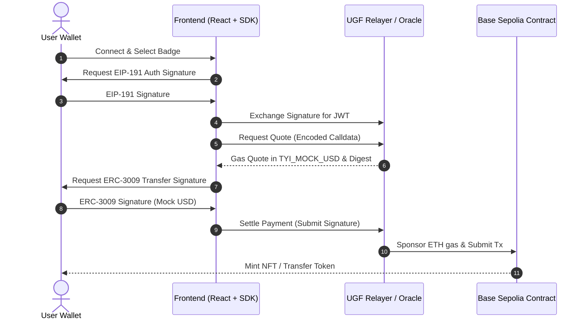

# ⚡ GasFreeBadge — Gasless Web3 Minter & Playground

Welcome to **GasFreeBadge**, a production-grade Web3 application showcasing **invisible UX** and gasless blockchain interactions on **Base Sepolia** powered by the **Universal Gas Framework (UGF)**.

🚀 **Live Application:** [gas-free-badge.vercel.app](https://gas-free-badge.vercel.app/)

---

## 📖 Table of Contents
- [Overview](#-overview)
- [How It Works (UGF Gasless Flow)](#-how-it-works-ugf-gasless-flow)
- [Key Features](#-key-features)
- [Project Architecture](#-project-architecture)
- [Deployment Details](#-deployment-details)
- [Getting Started](#-getting-started)
- [Hardhat Commands (Smart Contracts)](#-hardhat-commands-smart-contracts)
- [Testing with Mock USD (Faucet)](#-testing-with-mock-usd-faucet)

---

## 🌟 Overview

Historically, Web3 onboarding has suffered from high friction: users need native chain gas (ETH) before they can perform any transaction. **GasFreeBadge** solves this by integrating the **Universal Gas Framework (UGF)**. 

With UGF, users pay transaction fees using a stable settlement token (`TYI_MOCK_USD`) rather than native gas. Because UGF operates without ERC-4337 smart contract accounts, paymasters, or complex bundlers, users interact directly using their standard EOA wallets (like MetaMask or Coinbase Wallet) completely gaslessly!

---

## 🛠️ How It Works (UGF Gasless Flow)

Instead of sending transactions directly to the EVM network, the app goes through a 4-step secure gasless process:



1. **Authentication:** The user logs in via a secure standard EIP-191 message signature, which the `@tychilabs/ugf-testnet-js` SDK exchanges for a temporary JWT session.
2. **Quoting:** The app encodes the transaction payload (e.g., calling `claimBadge` on the smart contract) and sends it to the UGF Oracle to receive a gas fee quote denominated in `TYI_MOCK_USD`.
3. **Settlement:** The user signs a standard ERC-3009 transfer authorization (representing a gas fee payment using `TYI_MOCK_USD`). This requires **zero native ETH**.
4. **Execution:** UGF verifies the signatures, sponsors the native `ETH` required for gas, and submits the transaction on-chain.

---

## ✨ Key Features

- **🛡️ Gasless NFT Badge Claiming:** Claim three unique tiers of credentials:
  - 🟢 **Explorer Badge** (Type 0)
  - 🔵 **Builder Badge** (Type 1)
  - 🟣 **Pioneer Badge** (Type 2)
- **🤖 Ephemeral AI Agent Sessions:**
  - Create a secure, temporary keypair stored in-memory (isolated from the global scope).
  - Fund the agent using a gasless transfer.
  - Let the agent run autonomous on-chain actions (yield rebalancing, arbitrage, stablecoin collateral optimization) using its pre-authorized balance.
- **📅 Automated Subscription Billing:**
  - Simulates an automated recurring charge on-chain, automatically debiting 0.05 TYI from the agent's session wallet at regular intervals.
- **💸 Donation & Checkout Playgrounds:**
  - Gasless Checkout: Purchase goods/services on-chain gaslessly.
  - Gasless Donation: Support projects with custom token amounts.
  - Gasless Custom Send: Transfer tokens to any address on Base Sepolia.
- **📊 Real-time Blockchain Logs:** A beautiful live feed display showing transaction steps, status, and raw on-chain hashes linked to BaseScan.

---

## 📁 Project Architecture

Integrated monorepo — see **[SETUP.md](./SETUP.md)** for full stack instructions.

```text
NFT Blockchain project/
├── contracts/           # GasFreeBadge.sol, TyiWallet.sol
├── platform/            # Production API (NestJS + Formance + PostgreSQL)
│   ├── docker-compose.yml
│   └── api/             # Stripe-style /v1 REST + SIWE
├── frontend/            # React app — wallet, UGF claims, platform payments
│   └── src/api/platformClient.js
├── scripts/             # deploy.js, deploy-wallet.js, interact.js
└── backend/             # (legacy) Fastify v1 — use platform/ instead
```

---

## 🌐 Deployment Details

| Component | Target Network | Deployed Address |
| :--- | :--- | :--- |
| **`GasFreeBadge` NFT Contract** | Base Sepolia | `0x866d057Af43F711d7C3023fdCBFC474C4B12F187` |
| **`TYI_MOCK_USD` Token** | Base Sepolia | `0x9b9deeea99C2B77c0e7F7bdCf0a01a0F0843e5DD` |

- **Official Explorer:** [BaseScan Sepolia](https://sepolia.basescan.org/)
- **UGF Integration Engine:** Powered by `@tychilabs/ugf-testnet-js` v0.1.0

---

## 🚀 Getting Started

Follow these steps to run the application locally.

### 1. Prerequisites
- [Node.js](https://nodejs.org/) installed (v18+ recommended).
- An EVM Wallet (MetaMask, Rabby, Coinbase Wallet) connected to **Base Sepolia**.

### 2. Install Dependencies
Install packages at the root workspace:
```bash
npm install
```

Then install the frontend-specific dependencies:
```bash
cd frontend
npm install
```

### 3. Start Platform API (payments wallet)

```bash
cd platform && cp .env.example .env && docker compose up -d
cd api && npm install && npx prisma migrate deploy && npm run start:dev
```

### 4. Run the Frontend App

```bash
cd frontend && cp .env.example .env && npm install && npm run dev
```

Open http://localhost:5173 — connect wallet, **Sign in to wallet**, then use Send/Donate/Claim.

---

## 🛠️ Hardhat Commands (Smart Contracts)

If you wish to modify or redeploy the contract:

1. Create a `.env` file based on `.env.example` in the root directory:
   ```bash
   cp .env.example .env
   ```
2. Configure your `PRIVATE_KEY` and optional `BASESCAN_API_KEY`.
3. Use the following scripts:

- **Compile Contracts:**
  ```bash
  npm run compile
  ```
- **Run Contract Tests:**
  ```bash
  npm run test
  ```
- **Deploy to Base Sepolia:**
  ```bash
  npm run deploy:testnet
  ```
- **Verify Contract on BaseScan:**
  ```bash
  npm run verify
  ```

---

## ⛲ Testing with Mock USD (Faucet)

Because gasless transactions rely on the `TYI_MOCK_USD` token for fee settlement, your wallet needs to hold some `TYI` before calling UGF.

1. Head to the official **UGF Faucets**: [universalgasframework.com/faucets](https://universalgasframework.com/faucets)
2. Claim `TYI_MOCK_USD` on Base Sepolia to your connected wallet.
3. Import the token contract address in MetaMask if you wish to see your balance:
   `0x9b9deeea99C2B77c0e7F7bdCf0a01a0F0843e5DD`
4. Now, you can mint badges, pre-fund your autonomous agent, and complete purchases completely gas-free!
